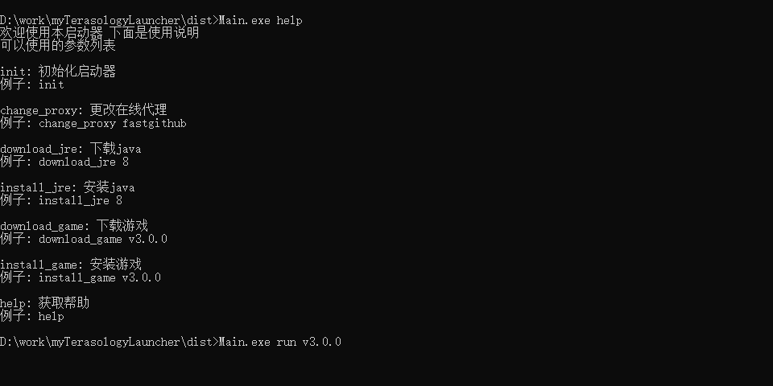
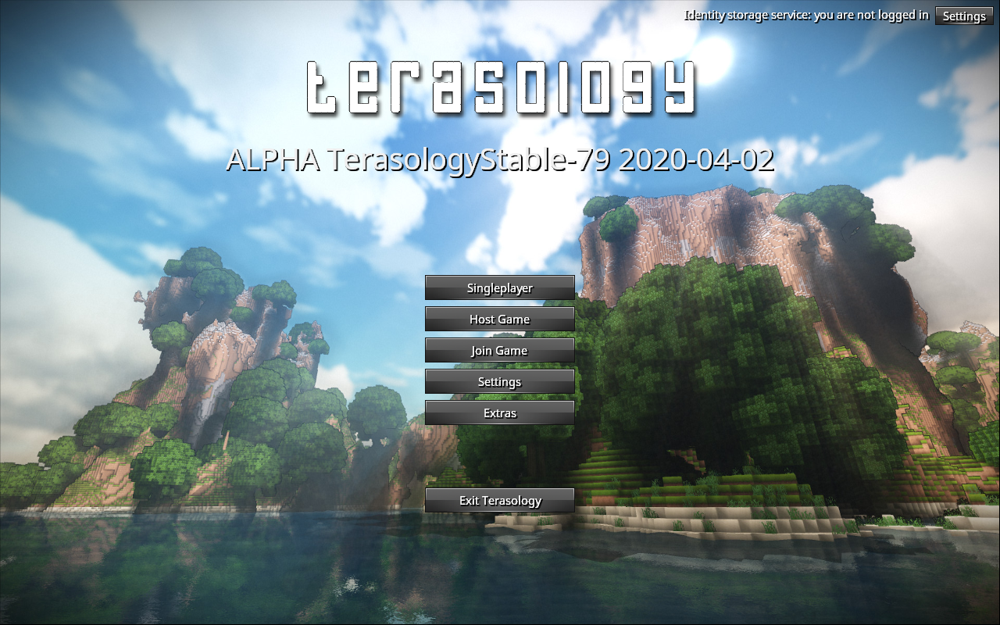

# 使用Nim语言编写的第三方Terasology启动器 （命令行）
默认只支持64位
# 截图

# 游戏截图

# 编译
1. 安装nim语言，mingw
2. build.cmd

# 运行
初始化启动器
```
Main.exe init
```
查看命令帮助 
```
Main.exe help
```
下载游戏
```
Main.exe download_game v3.0.0
```
安装游戏
```
Main.exe install_game v3.0.0
```
运行游戏
```
Main.exe run v3.0.0
```
切换游戏的下载代理 目前支持 `fastgithub` 和 `ghproxy`
```
Main.exe change_proxy fastgithub
```
下载安装java
```
Main.exe download_game 8
Main.exe install_game 8
```
# 启动器支持的引擎版本
v1.3.0 - v4.0.0
# 需要图形化启动器？ 看这里
[TerasologyLauncher](https://github.com/Cjjj-sys/TerasoiogyLauncher)